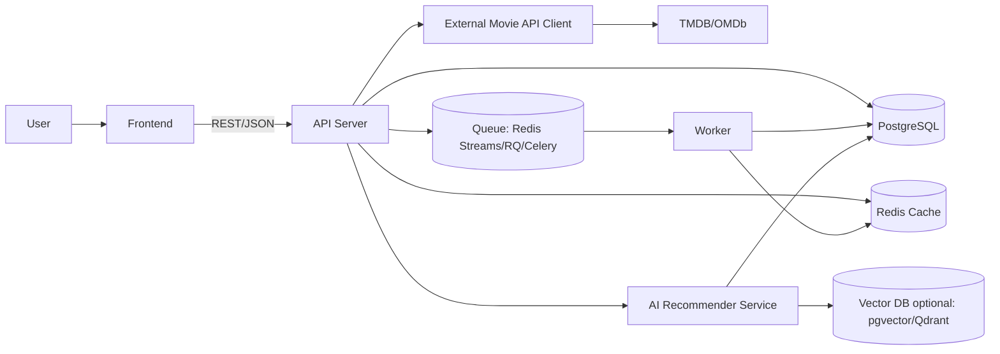

# 아키텍처

이 문서는 **영화 시나리오 분석 기록 플랫폼(Recovie)**의 백엔드 아키텍처를 정의합니다.  
목표는 “영화 API로 영화 정보를 가져오고(적재/동기화), 로그인 유저가 분석을 저장하며, 통계/추천(오늘의 추천·Top 분석 영화·카테고리 모음)을 제공”하는 흐름을 **Docker 기반 배포**까지 고려해 구조화하는 것입니다.

---

## 1. 요구사항 요약

### 핵심 기능
- **비로그인 사용자**
  - 영화 목록 조회(검색/페이징)
  - 영화 상세 조회
  - (선택) 공개 분석글 열람(추가 기능)
- **로그인 사용자**
  - 특정 영화에 대한 **시나리오 분석 작성/저장/수정/삭제**
  - 내 분석 모아보기(영화별/태그별/날짜별)
- **추천/발견(Discovery)**
  - 유저가 제일 많이 분석한 영화 Top N
  - 오늘의 분석 영화 추천(비로그인: 트렌딩 / 로그인: 개인화)
  - 카테고리별 영화 모음(장르/태그/테마)

### 비기능 요구사항
- **Docker Compose 기반 로컬 구동**
- 배포 환경 확장(백엔드/워커/AI 추천 서비스 분리)
- 외부 영화 API 적재 시 **중복 처리(upsert)** 및 **업데이트 기준(last_synced_at 등)** 필요
- 추천은 MVP(룰/통계) → 임베딩 → 온라인 랭킹/LLM 보조로 확장 가능해야 함

---

## 2. 전체 시스템 구성(논리 아키텍처)

### 구성 요소
- **Frontend(정적 웹)**: GitHub Pages 등(문서와 별개)
- **API Server**: 영화/분석/통계/추천 API 제공
- **DB(PostgreSQL 권장)**: 영화/분석/태그/통계 저장
- **Redis**: 캐시(영화 목록/추천), 큐(비동기 작업), 레이트리밋(선택)
- **Worker**: 영화 적재/재적재, 통계 집계, 추천 피처 업데이트
- **AI Recommender Service(선택, 분리 권장)**: 개인화 추천/임베딩/랭킹
- **External Movie API**: TMDB/OMDb 등 (영화 데이터 소스)

---

## 3. Mermaid 아키텍처 다이어그램

---

## 4. Docker 기준 실행 단위(서비스 분리)

### 최소 구성(MVP)

* `api-server`
* `postgres`
* `redis`

### 권장 구성(확장)

* `api-server`
* `worker`
* `ai-recommender`
* `postgres`
* `redis`
* (선택) `vector-db (qdrant)` 또는 `pgvector`
* (선택) `opensearch`(영화 검색이 커지면)

> 설계 포인트: 추천/적재/집계는 트래픽과 연산 성격이 달라서 **워커/추천을 분리**하면 운영이 편합니다.

---

## 5. 백엔드 모듈/레이어 구조

### 5.1 모듈(도메인) 구성

* `auth`: 회원가입/로그인/JWT
* `movie`: 영화 조회/상세/검색 + 외부 API 적재/동기화
* `analysis`: 분석 CRUD, 태그/카테고리 관리, 공개/비공개
* `stats`: Top 분석 영화, 카테고리 모음, 일간 집계
* `recommendation`: 오늘의 추천, 개인화 추천, 추천 로그
* `admin`(선택): 초기 적재 트리거, 재동기화 트리거, 모니터링

### 5.2 레이어(책임) 정의

#### Controller (Presentation Layer)

* HTTP 요청 라우팅, DTO validation
* 인증/인가: “비로그인 조회 허용 / 저장은 로그인 필수”
* 상태 코드 및 표준 응답 형태 유지

#### Service (Application Layer)

* 핵심 비즈니스 로직

  * 분석 저장 규칙(권한/유효성)
  * 영화 데이터 캐시 적용
  * 추천 요청 조합(트렌딩 + 개인화)
* 트랜잭션 경계(쓰기/수정/삭제)
* 워커 작업 발행(큐 enqueue)

#### Repository (Persistence Layer)

* DB 접근/쿼리 최적화
* 목록 조회(검색/페이징), 통계 집계 쿼리, upsert 지원

#### Client (Infrastructure Layer: External API Client)

* 외부 영화 API 호출(타임아웃/재시도/레이트리밋)
* 응답 정규화 및 도메인 모델로 매핑
* ETag/캐시(가능 시), last_synced_at 업데이트 정책 반영

#### Worker (Async Processing)

* 초기 적재/재적재(업데이트)
* 일간 통계 집계(movie_stats_daily 등)
* 추천 피처 업데이트(유저 선호 장르/태그, 임베딩 생성)

#### AI Recommender Service (선택)

* 임베딩 생성/저장
* 유사 영화 추천(벡터 검색)
* 온라인 랭킹/하이브리드 추천
* 추천 사유(reason) 생성(룰 기반 또는 LLM 보조)

---

## 6. 주요 데이터 흐름(시나리오)

### 6.1 비로그인 영화 목록/상세 조회

1. FE → BE: `GET /movies`
2. BE: Redis 캐시 확인(히트 시 즉시 반환)
3. 미스 시 DB 조회 → 캐시 저장 → 반환

### 6.2 로그인 사용자 분석 저장

1. FE → BE: `POST /movies/{id}/analyses` (JWT 필요)
2. BE: 사용자 권한 확인 → Service에서 저장 → 분석/태그 연관 처리
3. 통계 업데이트(동기 또는 큐로 비동기)
4. 반환

### 6.3 외부 영화 API 적재/재적재(비동기 권장)

1. Admin/스케줄러 → BE: sync 트리거
2. BE: 큐에 job 발행(예: `movie_sync_initial`)
3. Worker: 외부 API 호출 → `external_movie_id` 기준 upsert → last_synced_at 업데이트

### 6.4 오늘의 추천(하이브리드)

* 비로그인: 트렌딩 기반(최근 분석 증가 + 인기 + 다양성)
* 로그인: 개인화(내 분석 텍스트/태그/장르) + 트렌딩 혼합
* 추천 결과는 Redis에 캐시(짧은 TTL)

---

## 7. 추천(AI) 확장 로드맵

### MVP (룰/통계 기반, 빠른 구현)

* 오늘 추천 = 트렌딩(최근 분석 증가), 신규/인기 영화, 장르 다양성
* 개인화 = 유저가 많이 분석한 장르/태그 기반 점수화

### V1 (임베딩 기반 개인화)

* 입력: 영화 overview/keywords + 유저 분석 텍스트
* 처리: 임베딩 생성 → 벡터 검색으로 유사 영화 추천
* 저장: pgvector 또는 Qdrant

### V2 (온라인 랭킹)

* 이벤트(조회/클릭/분석작성)를 피처로 활용
* LightGBM/XGBoost ranking 또는 간단한 bandit 적용

### V3 (LLM 보조 기능)

* 분석 자동 태깅/키워드 추출
* “이 영화 분석 포인트 추천(스토리 구조/캐릭터/테마)” 코파일럿

---

## 8. 운영/확장 고려사항

### 관측(Observability)

* API 서버: 요청 로그, 에러 로그, latency
* 워커: job 처리량, 실패 재시도, DLQ(선택)
* 추천: 추천 노출/클릭/분석작성(전환) 로그

### 보안/권한

* JWT 기반 인증
* 분석 접근 제어: PUBLIC/PRIVATE/UNLISTED
* 관리자 API는 Role 기반 접근 제어

### 성능

* 목록/추천 캐시(Redis)
* 영화 검색이 커지면 OpenSearch 고려
* 통계는 가능한 비동기 집계(일간/주간)

---

## 9. 문서 링크(후속 문서)

* [API 명세](api.md)
* [DB 스키마](db.md)
* [외부 API 적재 정책](policy.md)
* [체크리스트](checklist.md)
