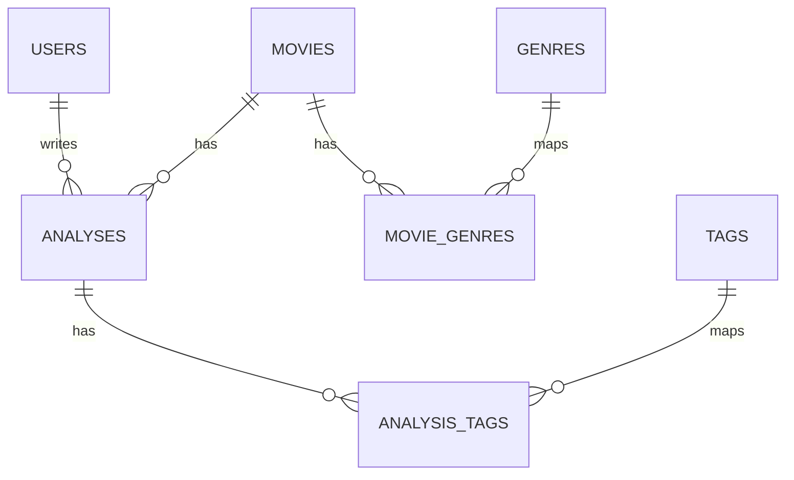

# DB 스키마

본 문서는 **영화 시나리오 분석 기록 플랫폼(Recovie)**의 DB 스키마를 정의합니다.  
초기 MVP(영화 조회 + 분석 저장 + 기본 통계/추천)부터, 추후 확장(공개 피드/검색/추천 고도화/AI 임베딩/이벤트 기반)을 고려해 설계합니다.

- DB 권장: **PostgreSQL**
  - 이유: JSON/FTS/인덱스 옵션/확장(pgvector) 등 확장성이 좋음
- 표기 규칙:
  - PK: `BIGSERIAL` 또는 `BIGINT`
  - 시간: `TIMESTAMPTZ`
  - soft delete: `deleted_at` (선택)
- 외부 영화 ID는 소스 포함 문자열로 통일 권장: `tmdb:550`

---

## 1. ERD 개요(핵심 엔티티)

---

## 2. 핵심 테이블(MVP)

## 2.1 users

로그인 사용자 정보

| 컬럼            | 타입           | 제약                      | 설명         |
| ------------- | ------------ | ----------------------- | ---------- |
| id            | BIGSERIAL    | PK                      | 사용자 ID     |
| email         | VARCHAR(255) | UNIQUE, NOT NULL        | 로그인 이메일    |
| password_hash | VARCHAR(255) | NOT NULL                | 비밀번호 해시    |
| nickname      | VARCHAR(50)  | NOT NULL                | 닉네임        |
| role          | VARCHAR(20)  | NOT NULL DEFAULT 'USER' | USER/ADMIN |
| created_at    | TIMESTAMPTZ  | NOT NULL                | 생성일        |
| updated_at    | TIMESTAMPTZ  | NOT NULL                | 수정일        |

**인덱스**

* `UNIQUE(email)`
* (선택) `INDEX(nickname)`

---

## 2.2 movies

외부 영화 API로 적재된 영화 마스터

| 컬럼                | 타입               | 제약               | 설명            |
| ----------------- | ---------------- | ---------------- | ------------- |
| id                | BIGSERIAL        | PK               | 내부 영화 ID      |
| external_movie_id | VARCHAR(50)      | UNIQUE, NOT NULL | 예: `tmdb:550` |
| title             | VARCHAR(255)     | NOT NULL         | 표기 제목         |
| original_title    | VARCHAR(255)     |                  | 원제            |
| overview          | TEXT             |                  | 줄거리           |
| release_date      | DATE             |                  | 개봉일           |
| runtime           | INT              |                  | 러닝타임(분)       |
| poster_url        | TEXT             |                  | 포스터           |
| backdrop_url      | TEXT             |                  | 배경 이미지        |
| popularity        | DOUBLE PRECISION |                  | 외부 API 지표     |
| vote_average      | DOUBLE PRECISION |                  | 평점            |
| vote_count        | INT              |                  | 투표수           |
| last_synced_at    | TIMESTAMPTZ      |                  | 마지막 동기화 시각    |
| created_at        | TIMESTAMPTZ      | NOT NULL         | 생성일           |
| updated_at        | TIMESTAMPTZ      | NOT NULL         | 수정일           |

**중복 기준(필수)**

* `external_movie_id UNIQUE` ✅

**인덱스 전략**

* `INDEX(title)` (검색)
* `INDEX(release_date)` (정렬/필터)
* `INDEX(popularity)` (인기순)
* (Postgres 권장) **FTS(전문검색)** 확장 시:

  * `GIN(to_tsvector('simple', title || ' ' || coalesce(overview,'')))`

---

## 2.3 genres

장르 마스터(외부 API 기반)

| 컬럼   | 타입          | 제약               | 설명      |
| ---- | ----------- | ---------------- | ------- |
| id   | BIGSERIAL   | PK               | 장르 ID   |
| name | VARCHAR(50) | UNIQUE, NOT NULL | Drama 등 |

---

## 2.4 movie_genres (N:M)

영화-장르 매핑

| 컬럼       | 타입     | 제약     | 설명        |
| -------- | ------ | ------ | --------- |
| movie_id | BIGINT | PK(FK) | movies.id |
| genre_id | BIGINT | PK(FK) | genres.id |

**제약/인덱스**

* `PRIMARY KEY(movie_id, genre_id)`
* `INDEX(genre_id, movie_id)` (장르별 영화 모음 빠르게)

---

## 2.5 analyses

유저가 작성한 분석 기록(핵심)

| 컬럼         | 타입           | 제약                         | 설명                      |
| ---------- | ------------ | -------------------------- | ----------------------- |
| id         | BIGSERIAL    | PK                         | 분석 ID                   |
| user_id    | BIGINT       | FK, NOT NULL               | users.id                |
| movie_id   | BIGINT       | FK, NOT NULL               | movies.id               |
| title      | VARCHAR(255) | NOT NULL                   | 분석 제목                   |
| content    | TEXT         | NOT NULL                   | 분석 본문                   |
| visibility | VARCHAR(20)  | NOT NULL DEFAULT 'PRIVATE' | PUBLIC/PRIVATE/UNLISTED |
| rating     | SMALLINT     |                            | 별점/선호(선택)               |
| created_at | TIMESTAMPTZ  | NOT NULL                   | 생성일                     |
| updated_at | TIMESTAMPTZ  | NOT NULL                   | 수정일                     |
| deleted_at | TIMESTAMPTZ  |                            | soft delete(선택)         |

**인덱스 전략(성능 핵심)**

* `INDEX(user_id, updated_at DESC)` : 내 분석 목록
* `INDEX(movie_id, updated_at DESC)` : 영화별 분석(공개 피드/통계)
* `INDEX(visibility, updated_at DESC)` : 공개 분석 목록(확장 시)
* (선택) `GIN` FTS: `content` 검색이 필요할 때

> “유저가 같은 영화에 분석을 여러 개 작성”하는 게 자연스러우므로
> `UNIQUE(user_id, movie_id)`는 **두지 않음**(요구사항에 따라 변경 가능)

---

## 2.6 tags + analysis_tags (확장 대비 기본 추천)

태그는 분석의 탐색/추천 품질에 크게 도움됨.

### tags

| 컬럼   | 타입          | 제약               | 설명                     |
| ---- | ----------- | ---------------- | ---------------------- |
| id   | BIGSERIAL   | PK               | 태그 ID                  |
| name | VARCHAR(50) | UNIQUE, NOT NULL | structure, character 등 |

### analysis_tags (N:M)

| 컬럼          | 타입     | 제약     | 설명          |
| ----------- | ------ | ------ | ----------- |
| analysis_id | BIGINT | PK(FK) | analyses.id |
| tag_id      | BIGINT | PK(FK) | tags.id     |

**인덱스**

* `PRIMARY KEY(analysis_id, tag_id)`
* `INDEX(tag_id, analysis_id)` : 태그별 분석 탐색

---

## 3. 확장 테이블(추천/통계/이벤트/검색)

## 3.1 user_movie_stats (유저 Top 분석 영화 빠르게)

유저별 분석 횟수 집계(쿼리 부하 줄임)

| 컬럼               | 타입          | 제약                 | 설명        |
| ---------------- | ----------- | ------------------ | --------- |
| user_id          | BIGINT      | PK(FK)             | users.id  |
| movie_id         | BIGINT      | PK(FK)             | movies.id |
| analysis_count   | INT         | NOT NULL DEFAULT 0 | 분석 횟수     |
| last_analyzed_at | TIMESTAMPTZ |                    | 마지막 분석 시각 |

**인덱스**

* `PRIMARY KEY(user_id, movie_id)`
* `INDEX(user_id, analysis_count DESC)` ✅ (Top N)

> 집계 업데이트 방식
>
> * 동기(분석 저장 시 바로 증가) 또는
> * 비동기(이벤트/큐 처리) 둘 다 가능

---

## 3.2 movie_stats_daily (오늘의 추천/트렌딩)

일 단위로 “분석/조회/점수”를 저장해 추천과 랭킹에 활용

| 컬럼             | 타입               | 제약                 | 설명          |
| -------------- | ---------------- | ------------------ | ----------- |
| date           | DATE             | PK                 | 기준 날짜       |
| movie_id       | BIGINT           | PK(FK)             | movies.id   |
| analysis_count | INT              | NOT NULL DEFAULT 0 | 그날 분석 수     |
| view_count     | INT              | NOT NULL DEFAULT 0 | 그날 조회 수(선택) |
| trending_score | DOUBLE PRECISION | NOT NULL DEFAULT 0 | 트렌딩 점수      |
| updated_at     | TIMESTAMPTZ      | NOT NULL           | 갱신 시각       |

**인덱스**

* `PRIMARY KEY(date, movie_id)`
* `INDEX(date, trending_score DESC)` ✅ (오늘 추천)

---

## 3.3 recommendation_logs (추천 품질 개선)

추천 노출/클릭/분석작성 전환을 기록해 모델 개선에 사용

| 컬럼          | 타입               | 제약           | 설명                |
| ----------- | ---------------- | ------------ | ----------------- |
| id          | BIGSERIAL        | PK           | 로그 ID             |
| user_id     | BIGINT           | FK           | 비로그인 추천은 NULL 가능  |
| date        | DATE             | NOT NULL     | 추천 날짜             |
| strategy    | VARCHAR(50)      | NOT NULL     | hybrid_trending 등 |
| movie_id    | BIGINT           | FK, NOT NULL | 추천된 영화            |
| score       | DOUBLE PRECISION |              | 추천 점수             |
| reason      | TEXT             |              | 추천 사유             |
| shown_at    | TIMESTAMPTZ      | NOT NULL     | 노출 시각             |
| clicked_at  | TIMESTAMPTZ      |              | 클릭                |
| analyzed_at | TIMESTAMPTZ      |              | 분석 작성(전환)         |

**인덱스**

* `INDEX(date)`
* `INDEX(user_id, date)`
* `INDEX(movie_id, date)`

---

## 3.4 movie_credits (선택: 감독/캐스트 정규화)

초기엔 `movies.credits JSON`로 저장해도 되지만, 확장(필터/검색) 시 분리 가능

| 컬럼          | 타입           | 제약           | 설명            |
| ----------- | ------------ | ------------ | ------------- |
| id          | BIGSERIAL    | PK           | 인물 ID         |
| movie_id    | BIGINT       | FK, NOT NULL | movies.id     |
| person_name | VARCHAR(255) | NOT NULL     | 이름            |
| role        | VARCHAR(50)  | NOT NULL     | DIRECTOR/CAST |
| order_no    | INT          |              | 출연 순서(선택)     |

**인덱스**

* `INDEX(movie_id, role)`
* (선택) `INDEX(person_name)`

---

## 3.5 event_logs (추천/통계 “실시간화”를 위한 이벤트 수집, 선택)

“조회/클릭/작성” 이벤트를 남겨 워커가 집계/추천 피처 업데이트

| 컬럼          | 타입          | 제약       | 설명                                   |
| ----------- | ----------- | -------- | ------------------------------------ |
| id          | BIGSERIAL   | PK       | 이벤트 ID                               |
| user_id     | BIGINT      | FK       | NULL 가능                              |
| event_type  | VARCHAR(30) | NOT NULL | MOVIE_VIEW/REC_CLICK/ANALYSIS_CREATE |
| movie_id    | BIGINT      | FK       | 관련 영화                                |
| analysis_id | BIGINT      | FK       | 관련 분석                                |
| payload     | JSONB       |          | 추가 정보(UA 등)                          |
| created_at  | TIMESTAMPTZ | NOT NULL | 생성일                                  |

**인덱스**

* `INDEX(event_type, created_at DESC)`
* `INDEX(movie_id, created_at DESC)`
* (선택) 파티셔닝(월별) 고려 가능

---

## 4. AI/임베딩 확장(선택)

## 4.1 movie_embeddings (pgvector 사용 시)

Postgres에 `pgvector` 확장 적용하면 벡터 검색 가능

| 컬럼         | 타입          | 제약       | 설명        |
| ---------- | ----------- | -------- | --------- |
| movie_id   | BIGINT      | PK(FK)   | movies.id |
| model      | VARCHAR(50) | NOT NULL | 임베딩 모델명   |
| embedding  | VECTOR      |          | 벡터        |
| updated_at | TIMESTAMPTZ | NOT NULL | 갱신        |

**인덱스**

* 벡터 인덱스(IVFFLAT/HNSW)는 pgvector 설정에 따라 추가

> 벡터 DB를 따로(Qdrant) 쓰면 이 테이블 대신 외부 저장소 사용

---

## 5. 제약조건(Constraints) 요약

* `movies.external_movie_id` **UNIQUE** (중복 기준 핵심)
* `users.email` **UNIQUE**
* `movie_genres` / `analysis_tags`는 **복합 PK로 중복 방지**
* `analyses.visibility`는 ENUM처럼 값 제한(애플리케이션 레벨 + DB CHECK 권장)

예: (Postgres CHECK)

* `visibility in ('PUBLIC','PRIVATE','UNLISTED')`

---

## 6. 인덱스 전략 요약(필수/권장)

### 필수(초기 성능)

* `movies(external_movie_id UNIQUE)`
* `movies(title)`, `movies(release_date)`
* `analyses(user_id, updated_at DESC)`
* `analyses(movie_id, updated_at DESC)`
* `user_movie_stats(user_id, analysis_count DESC)`
* `movie_stats_daily(date, trending_score DESC)`

### 성장 시 권장

* 영화/분석 전문검색 FTS(GIN)
* 이벤트 로그 파티셔닝
* 벡터 검색 인덱스(pgvector) 또는 별도 Vector DB

---

## 7. 데이터 유지/삭제 정책(선택)

* 분석 삭제는 soft delete(`deleted_at`) 권장

  * 추천/통계 로그의 참조 일관성을 유지하기 쉬움
* 영화 데이터는 외부 API 기반이므로 삭제보다 “비활성화 플래그”가 안전(선택)

---

## 8. 마이그레이션 전략(권장)

* 스키마 변경은 Flyway/Liquibase로 관리 권장
* 통계/이벤트/추천 테이블은 나중에 추가 가능하도록 모듈 분리

---

## 9. 구현 체크 포인트

* 외부 API 적재 시 `external_movie_id` 기준 **UPSERT** 필수
* 분석 저장 시 `user_movie_stats`/`movie_stats_daily` 업데이트는

  * 동기(간단) 또는
  * 이벤트/큐 기반 비동기(확장성)로 설계 가능
